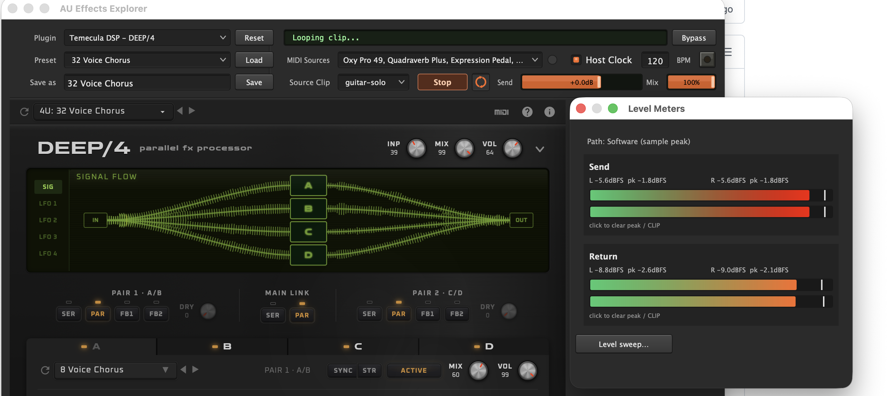
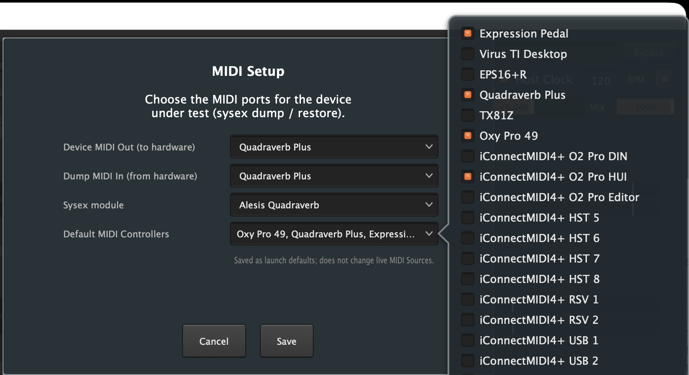
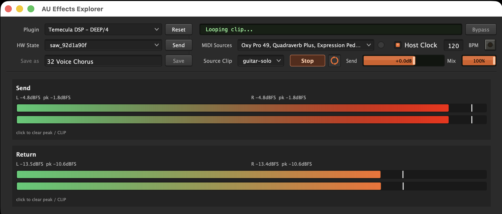
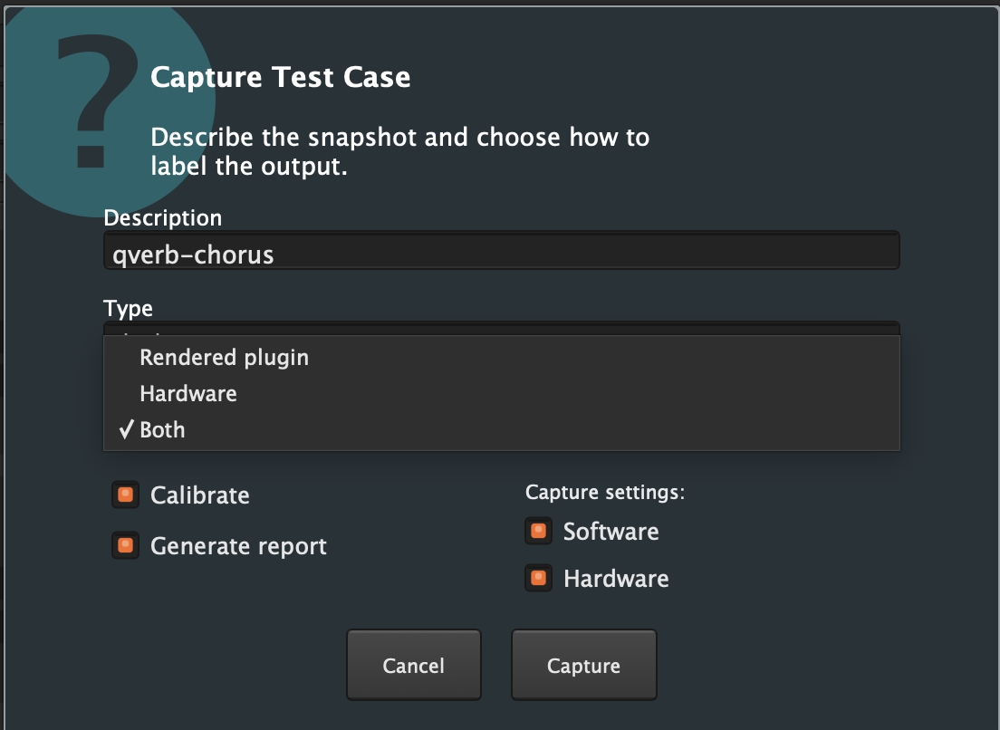

# AU Effects Explorer

**AU Effects Explorer** is the host app in the [aufx-test](../README.md) framework. It is designed to compare audio processing between software Audio Units and hardware effects (hardware-in-loop), and to capture reproducible test cases for defect reports and automation. It also works as a lightweight AU host for manual testing—MIDI, transport, and playhead features without a full DAW.

When you select a plugin you begin an *exploration session*. Captures land under that session’s folder (input clip, rendered / hardware WAVs, `.aupreset`, optional sysex, and compare reports).




## Features

- Hosting of arbitrary Audio Unit effects
- Mock DAW features: host playhead, BPM, MIDI clock, and metronome click (for tempo-synced plugins)
- Canned **Source Clips** under `fixtures/` (plus drop-in externals)
- Host **Bypass**, **Send** level (−120 dB mute … +6 dB), and **Mix** (dry/wet)
- MIDI controller ports and MIDI Learn–friendly routing
- Hardware-in-loop insert (send / return / monitor) with easy switching between hardware and software (`Cmd+U`)
- Send/Return level metering (sample peak, sticky hold, CLIP) and optional LUFS/RMS level sweeps
- Save / Load `.aupreset` state; drag-and-drop import into the plugin’s presets folder
- Experimental sysex dump / restore for test setup (**Alesis Quadraverb** only for now)
- **Capture Test Case** — packages artifacts for regression and bug reports (golden / broken / suspect)
- Optional HTML compare report after capture (software vs hardware, or dry vs wet)
- Calibration: insert latency auto-detect, noise-floor / DC for hardware capture, level-sweep plots
- **Lights Out** mode for screencaps; monitor path supports Multi-Output Devices / loopbacks so audio is in the recording

Compares use objective metrics (level gain vs dry/reference, correlation, etc.)—not bit-for-bit equality. Typical flow: explore in the app → capture → `aufx-test session promote` / `export` → `pytest`, or batch goldens with `aufx-test compare-batch`.

## Requirements

- macOS 13+
- Universal build (`arm64` + `x86_64`)
- Audio Units installed under `/Library/Audio/Plug-Ins/Components/` or `~/Library/Audio/Plug-Ins/Components/`


## Install (GitHub Releases)

Download the prebuilt **AU Effects Explorer** app from the project’s [GitHub Releases](https://github.com/tymcode/aufx-test/releases).

The build is currently self-signed, so Gatekeeper may block the first launch:

1. Unzip the archive (do not run from inside the zip).
2. Clear quarantine if needed: `xattr -cr "AU Effects Explorer.app"`
3. Right-click the app → **Open** (first launch), or: **System Settings → Privacy & Security → Open Anyway**

For day-to-day work against this repo, open the app with your project `host.config.json` (see [Launch](#launch)). Building from source is covered in [Building from source](#building-from-source) at the bottom of this page.

## Launch


### With the repo config (recommended for development)

```bash
cd /path/to/aufx-test

APP="native/build/plugin_host_app/plugin_host_app_artefacts/Release/AU Effects Explorer.app"
# or: dist/AU Effects Explorer.app after packaging / a Release download

open "$APP" --args \
  --config "$(pwd)/host.config.json" \
  --project-root "$(pwd)"
```

Optional Python wrapper (requires a working `.venv`):

```bash
source .venv/bin/activate
aufx-test host
# aufx-test host --config path/to/host.config.json --project-root .
```


### Standalone (Release / packaged app)

Without `--project-root` / `--config`, the app uses its exploration data folder (default `~/Library/Application Support/AU Effects Explorer/`), seeds a local `host.config.json` from the bundle, and reads fixtures from the app Resources when needed.

## Configure plugins

Edit `host.config.json` at the project root for the repo-rooted workflow. The toolbar **Plugin** dropdown is seeded from this list. Use **Plugins → Add Plugin…** (or **More plugins…** in the picker) to choose from the AU scan cache. **Plugins → Rescan Audio Units…** (`Cmd+R`) refreshes the cache; **Install New Source Clips…** installs WAVs into the fixtures tree; **Rescan Source Clips** (`Cmd+Shift+R`) reloads the menu.

```json
{
  "fixtures_dir": "fixtures",
  "sessions_root": "sessions",
  "python_cli": ".venv/bin/aufx-test",
  "log_file": "sessions/plugin_host.log",
  "default_plugin": "deep_z",
  "plugins": [
    {
      "id": "deep_z",
      "name": "DEEP/Z",
      "manufacturer": "Temecula DSP",
      "path": "AudioUnit:Effects/aumf,DPPL,TDSP",
      "presets_dir": "~/Library/Audio/Presets/Temecula DSP/DEEP/Z",
      "default_preset": "~/Library/Audio/Presets/Temecula DSP/DEEP/Z/Init Serial.aupreset",
      "session": "DEEP/Z exploration"
    }
  ]
}
```

Paths may be absolute, `~/…`, or relative to the project root. `default_preset` and the aufx-test CLI path (`python_cli` in JSON) are optional (the CLI is required for **Generate report** and `calibrate-plot` PNG helpers). Each launch appends an 8-character hash to `log_file` (e.g. `sessions/plugin_host_a1b2c3d4.log`).

**Settings…** (Apple menu) can override the exploration data folder and config file path (relaunch to apply), plus Source Clips Directory, Sessions directory, aufx-test CLI location, and Default plugin (saved immediately to `host.config.json`). Audio Unit hosting prefs live under **Plugins → Audio Unit Settings…**.

## Basic use

1. At first launch the host scans for installed AUs (or on first **Add Plugin…**). Keep the dropdown lean: add only the plugs you need; remove with the **x** on a row.
2. Select a plugin, pick a **Source Clip**, click **Begin** (Space toggles Begin/Stop when a text field is not focused).
3. For MIDI Learn / controllers: **Session → MIDI Setup…**
4. For hardware-in-loop: **Session → Hardware Audio Setup…**, then **Session → Use Hardware** (`Cmd+U`) to switch the monitor path.
5. When a setup is good (or broken), **Session → Capture Test Case…** (`Cmd+T`). Mark it **golden**, **broken**, or **suspect**. The app reveals the artifact folder for bug reports or automation.


## Main window

```
┌────────────────────────────────────────────────────────────┐
│ Plugin ▼ | status…                                         │
│ Preset ▼ [Load]  Save as [____] [Save]  ☐ Replace          │
│   (in Use Hardware: HW State ▼ [Send] instead of Save)     │
│ Source Clip ▼  [Begin/Stop]  Loop  Bypass  Send  Mix       │
│ MIDI Sources ▼  Host Clock  [BPM]  Click                   │
│ ┌────────────────────────────────────────────────────────┐ │
│ │  plugin UI  — or Send/Return meters when Use Hardware  │ │
│ └────────────────────────────────────────────────────────┘ │
└────────────────────────────────────────────────────────────┘
```


| Control                             | Purpose                                                                                                                                                                                      |
| ----------------------------------- | -------------------------------------------------------------------------------------------------------------------------------------------------------------------------------------------- |
| **Plugin**                          | Entries from `host.config.json`; **More plugins…** opens Add Plugin dialog to specify which canned plugin you want in the list                                                               |
| **Preset** / **Load** / **Save as** | Soft path: load/save the plugin's current state as an `.aupreset` under that plugin’s `presets_dir.` **Select other…** opens a file chooser (defaults to this exploration’s session folder). |
| **HW State** / **Send**             | Hardware mode: pick a `.syx` dump and transmit to the device configured in *MIDI Setup*. **Select other…** browses for a dump (defaults to the session folder).                              |
| **Source Clip**                     | Fixture audio from `fixtures/` (grouped by folder); **Select Other…** browses for a WAV (remembers last folder; temporary top-level entry); **Loaded** for Load Testcase externals           |
| **Begin** / **Stop**                | Play the clip through the current path (loop or one-shot)                                                                                                                                    |
| **Loop icon button**                | Loop vs one-shot                                                                                                                                                                             |
| **Bypass**                          | Dry thru the host (disabled in Use Hardware mode)                                                                                                                                            |
| **Send**                            | Input level to the effect path (−120 dB … +6 dB)                                                                                                                                             |
| **Mix**                             | Dry/wet percent                                                                                                                                                                              |
| **MIDI Sources**                    | Enable control surface / Learn ports (devices from the MacOS Audio MIDI Setup)                                                                                                               |
| **Host Clock**                      | Drive host playhead + MIDI clock for testing tempo-based parameters                                                                                                                          |
| **BPM**                             | Tempo (20–999); Press Return or leave the field to apply the change                                                                                                                          |
| **Metronome LED button**            | Metronome LED flashes on quarter notes when Host Clock is on; click it to toggle emitting an audible click                                                                                   |


Drag `.aupreset` files or folders onto the window to import into the current plugin’s presets folder (confirm replace if needed).

### Keyboard shortcuts


| Shortcut        | Action                                                                  |
| --------------- | ----------------------------------------------------------------------- |
| **Space**       | Begin / Stop                                                            |
| **Cmd+T**       | Capture Test Case…                                                      |
| **Cmd+U**       | Use Hardware (toggle)                                                   |
| **Cmd+M**       | Level Meters window                                                     |
| **Cmd+L**       | Lights Out mode blacks out the background                               |
| **Cmd+R**       | Rescan Audio Units…                                                     |
| **Cmd+Shift+R** | Rescan Source Clips to use source clips added to the `fixtures` folder. |


## Setup dialogs


### MIDI Setup… (Session menu)



Choose ports for the device under test and which sysex module to use:

- **Device MIDI Out (to hardware)**
- **Dump MIDI In (from hardware)** — added alongside other MIDI Sources (does not replace them)
- **Sysex module** — currently **Alesis Quadraverb**
- **Default MIDI Controllers** — checklist like the main-window **MIDI Sources** field; saved as `default_midi_input` in `host.config.json` for the next launch. Does **not** change live MIDI Sources enablement.

Required for Capture **Hardware** sysex dumps and for **HW State → Send**.

### Hardware Audio Setup… (Session menu)

Configures the CoreAudio insert loop. Software processing is muted while this dialog is open so you hear the raw loop.


| Control                  | Purpose                                                                                                                                                              |
| ------------------------ | -------------------------------------------------------------------------------------------------------------------------------------------------------------------- |
| **Audio Interface**      | Duplex device for send/return                                                                                                                                        |
| **Send pair**            | Stereo outs to the hardware, or **None Selected**                                                                                                                    |
| **Return pair**          | Stereo ins from the hardware, or **None Selected**                                                                                                                   |
| **Monitor output**       | Interface monitor pair, system default output, or a separate device (e.g. Multi-Output Devices with loopback for screencaps)                                         |
| **Monitor pair**         | Speakers on the interface (when using interface monitor)                                                                                                             |
| **Buffer size**          | Device buffer (disabled when send/return are None)                                                                                                                   |
| **Latency (samples)**    | Manual trim, or **Auto-detect** (disabled when send/return are None)                                                                                                 |
| **Auto-detect**          | Plays `fixtures/impulse.wav` five times through the send, averages correlation-peak latency (and reports loop gain). Put the hardware on a dry/bypass program first. |
| **Test** / **Stop Test** | Sends the current Source Clip through the loop so you can check routing and levels; live Send/Return VU meters update in the panel                                   |
| **Save** / **Cancel**    | Cancel restores the previous loop settings                                                                                                                           |


Choosing **None Selected** on either send or return clears both, removes the hardware-loop block from preferences, and turns off **Use Hardware**. Buffer size, latency, Auto-detect, and Test stay disabled until both pairs are set again.

### Settings… (Apple menu)

- Exploration data folder (Choose / Reveal) — relaunch to apply
- Optional config file override — relaunch to apply
- **Source Clips Directory** — sets `fixtures_dir`; moves the current clips collection here, or copies from the app bundle when the previous location was bundled/empty; Source Clip menu rescans immediately
- **Sessions directory** — sets `sessions_root`; moves existing session folders and rewrites absolute paths in `session.json` so artifact links survive
- **Location of aufx-test CLI** — sets the executable used for **Generate report** and calibrate PNGs (JSON key `python_cli`). Hint suggests `<repo>/.venv/bin/aufx-test` when exploration / clips / sessions paths look like an aufx-test checkout. **Test** turns green/red/grey; absolute or `~/…` path recommended for Release builds
- **Default plugin** — sets `default_plugin` (applies on next launch)

Folder/config overrides need a relaunch. The other fields write `host.config.json` immediately.

### Add Plugin… / Audio Unit Settings / Source Clips (Plugins menu)

- **Add Plugin…** — Adds plugins to the dropdown in the main app window. Equivalent to selecting **More Plugins** from the dropdown. Multi-select from the AU list that was built during the AU scan. Search filter by name/manufacturer.
- **Audio Unit Settings…** — Allow input to virtual instruments (off by default—some AUs crash with unused input buses); plugin scan timeout; list of skipped AUs (crashed/hung) with **Retry selected**
- **Rescan Audio Units…** (`Cmd+R`) — rebuilds the AU cache. Use after installing new plugins. (Not new builds of cached plugins.)
- **Install New Source Clips…** — two-column mover: pick WAV files on the left, choose (or create) a target folder in the fixtures tree on the right, then **Install**. If the current Source Clips folder is read-only (e.g. app-bundled), prompts **Select a folder for the collection.**
- **Rescan Source Clips** (`Cmd+Shift+R`) — reloads the Source Clips Directory into the Source Clip menu (useful after dropping new WAVs into the tree).


## Use Hardware (`Cmd+U`)

When the insert loop is configured, **Session → Use Hardware** switches monitoring and metering to the hardware path:

- Plugin editor is replaced by inline Send/Return meters
- Bypass is disabled; preset **Save** is replaced by **HW State** / **Send**
- Level Meters window (if open) follows the same path



Toggle again to return to software.

## Capture Test Case… (`Cmd+T`)



Dialog fields:


| Field           | Options                                                                                                    |
| --------------- | ---------------------------------------------------------------------------------------------------------- |
| **Description** | Free text (becomes part of the snapshot identity)                                                          |
| **Type**        | `golden` (expect match), `broken` / `suspect` (expect mismatch; suspect currently same as broken)          |
| **Capture**     | Rendered plugin, Hardware, or Both. Hardware / Both are disabled until Hardware Audio Setup is configured. |


**When capturing:**

- **Software** — Runs currently selected **Source Clip** through the plugin and captures the results.  
- **Hardware** —Runs the currently selected **Source Clip** through the external hardware and captures the results. Recording will be automatically stopped after:
  - The length of the software capture, if selected, or
  - The sound drops to the noise floor of the device, or
  - 60 seconds, by default.

**Options**

- **Generate report** (default on): after a successful capture, runs `aufx-test compare --root … --write-report` for the new snapshot (Settings **aufx-test CLI** must point at a working `.venv/bin/aufx-test`)
- **Calibrate** (if Hardware or Both is selected; default on): measure return noise floor for the silence gate and subtract DC offset from the hardware WAV before write
- **Capture settings → Hardware**:  If Hardware is selected under **Capture settings…**, it requests a sysex dump of the current device settings (if configured in **MIDI Setup**).
- **Capture settings → Software:** If Software is selected under **Capture settings…**, it writes an `.aupreset` from the *live* plugin state (not merely the last loaded file).

What gets written under `sessions/<session>/artifacts/<stem>/`:

- `<stem>_input.wav` (a copy of the Source Clip)
- Software: `<stem>_output_<gld|sus|bkn>.wav (The WAV rendered through the plugin)`
- Hardware: `<stem>_output_hw_<gld|sus|bkn>.wav (The WAV captured from the hardware loop)`
- `<stem>.aupreset` when selected in Capture settings
- `<stem>.syx` when selected in Capture settings and receiving Hardware settings sysex succeeds
- Compare artifacts (`compare_report.html`, plots, JSON) when **Generate report** is selected

Hardware capture continues until the return falls silent (gate), you press **Stop**, or a safety limit—so long reverb tails are kept. Lights Out turns off automatically after a successful capture.

## Restore Testcase State…

**Session → Restore Testcase State…** opens a folder picker defaulting to the current exploration’s `artifacts/` folder.

- **Open** — enter the selected subfolder (disabled when nothing is selected)
- **Choose** — restore from the selected folder, or from the currently displayed directory when nothing is selected
- Directory listings show files dimmed alongside folders; the path field ellipsizes leading ancestors so the leaf name stays visible

Restore loads `<stem>_input.wav` as a temporary top-level Source Clip (and selects it), applies `<stem>.aupreset` (preset menu shows the basename), and sends `<stem>.syx` when a sysex file is present and hardware + sysex device are configured in MIDI Setup. A confirmation reports `{stem} state restored.` and, when hardware is configured, reminds you to adjust physical gain controls.

## Calibration

Three related but separate tools:


| Tool                             | Where                       | What                                                                                                                              |
| -------------------------------- | --------------------------- | --------------------------------------------------------------------------------------------------------------------------------- |
| **Auto-detect** latency          | Hardware Audio Setup        | Impulse ×5 → latency samples + loop gain                                                                                          |
| **Calibrate** (noise floor / DC) | Capture Test Case (HW/Both) | Sets silence gate above the return noise floor; DC offset correction                                                              |
| **Level sweep…**                 | Level Meters window         | Stepped send gains through the *current* path; plots send vs. return to `calibration/<slug>.json` (+ PNG if aufx-test CLI is set) |


Level sweep uses `fixtures/synth_waves/sine_0db_1ch_5s_48k.wav` and records sample peak, RMS, and BS.1770-style LUFS per step. Re-plot later with:

```bash
aufx-test calibrate-plot calibration/my_plot.json -o calibration/my_plot.png
```


## Level Meters (`Cmd+M`)

Floating **Level Meters** window: live **Send** / **Return** sample-peak meters for the active Software or Hardware path, sticky peak hold, and CLIP badge (click a meter to clear). **Level sweep…** starts a named calibration run (see above).

## Lights Out (`Cmd+L`)

Blacks out every display behind the host, keeps the app on top, and hides the Dock / menu bar—useful for screencaps. **Level Meters** (`Cmd+M`) stays available above the blackout. Prefer a Multi-Output Device that includes your loopback so the recorded video contains the audio. Cleared automatically after Capture Test Case succeeds (or toggle again).

## Presets (`.aupreset`)

- **Load** — apply a file from the plugin’s `presets_dir`, or **Select other…** to browse (defaults to this exploration’s session folder)
- **Save as** + **Save** — write the live plugin state; **Replace existing** overwrites the same name
- Drag-and-drop `.aupreset` onto the main window to import
- Capture with **Software** settings on always saves live state into the snapshot folder


## Sysex

Experimental, limited to devices in the **Sysex Module** dropdown in **MIDI Settings**. 

- **Capture** with **Hardware** settings on → dump to `<stem>.syx`
- **Use Hardware** → choose **HW State** and **Send** to restore a dump to the unit (**Select other…** browses for a `.syx`, defaulting to the session folder)

Other modules are not registered yet.

## Host clock, tempo, and transport

Enable **Host Clock** so tempo-synced parameters like Delay Time see a DAW playhead (4/4, BPM, PPQ). Set **BPM**, optionally click the metronom light to hear a quarter-note **Click**. External MIDI Start/Stop (and common surface mappings) can Begin/Stop the Source Clip and drive the host clock when enabled.

## After capturing — promote, export, compare

```bash
aufx-test session show
aufx-test session show "DEEP/Z exploration"

# List unpromoted snapshots, then promote (role inferred from _gld / _bkn when present)
aufx-test session promote "DEEP/Z exploration"
aufx-test session promote "DEEP/Z exploration" my_snap_gld --test-name my_snap

aufx-test session export "DEEP/Z exploration" -o tests/generated/test_deepz.py
aufx-test session export-presets "DEEP/Z exploration" -o share/with-developer/
```

Score a captured snapshot (hardware vs software when both exist; otherwise informational dry vs wet):

```bash
aufx-test compare --root sessions "DEEP/Z exploration" my_snap_gld --write-report
```

Report files land under the snapshot’s `artifacts/<stem>/` (`compare_report.html`, waveforms, metrics). See the top-level [README](../README.md) for the full CLI table (`compare-batch`, etc.).

Headless CI replay uses `plugin_renderer` + `SubprocessPluginHost` with the captured `.aupreset`—see [plugin-renderer.md](plugin-renderer.md).

## Troubleshooting


| Problem                                 | Fix                                                                                              |
| --------------------------------------- | ------------------------------------------------------------------------------------------------ |
| Gatekeeper blocks the app               | `xattr -cr "AU Effects Explorer.app"`; Right-click → Open                                        |
| `aufx-test: command not found`          | Activate `.venv` or use `.venv/bin/aufx-test` (CLI / reports only; hosting does not need Python) |
| Plugin host app not found               | Build from source (below) or install from Releases                                               |
| Config / plugin path errors             | Edit `host.config.json`; check `path` / AU id                                                    |
| No presets in dropdown                  | Set `presets_dir` for that plugin                                                                |
| Generate report / calibrate PNG skipped | Set aufx-test CLI in Settings (typically `<repo>/.venv/bin/aufx-test`) and use **Test**          |
| Need logs                               | `sessions/plugin_host_<hash>.log`                                                                |
| No audio on Begin                       | Check macOS output device; confirm Hardware Audio Setup / Use Hardware path                      |


## Legacy: `aufx-test explore` REPL

The older **explore** command is a terminal REPL for building sessions *without* the GUI: you bounce audio in a DAW (or elsewhere), then point the REPL at WAVs / presets interactively.

```bash
aufx-test explore \
  --new-name "DEEP/Z exploration" \
  --plugin "/Library/Audio/Plug-Ins/Components/TemeculaDSPDEEPZ.component"
```


|                    | **explore REPL**                             | **Explorer +** `aufx-test compare`                                        |
| ------------------ | -------------------------------------------- | ------------------------------------------------------------------------- |
| Capture            | Manual bounce + interactive prompts          | In-app Capture Test Case (`Cmd+T`)                                        |
| Hearing / HIL      | Not in the REPL                              | Full hardware loop, meters, Test, Calibrate                               |
| Scoring a snapshot | Not its job                                  | `aufx-test compare --root sessions <session> <snapshot> [--write-report]` |
| Automation export  | Via session promote/export after snaps exist | Same promote/export path after GUI captures                               |


Prefer **AU Effects Explorer** for day-to-day work. Use **explore** only when you already have external bounces and want a scripted session without launching the app. To *evaluate* captures, use `aufx-test compare` (with `--root` for session snapshots)—there is no `session compare` subcommand.

Non-interactive snaps without either GUI or REPL:

```bash
aufx-test session snap "MyEffect" "half mix" \
  --input fixtures/synth_waves/sine.wav \
  --output ~/Desktop/bounce.wav \
  --aupreset ~/Library/Audio/Presets/MyEffect/half_mix.aupreset
```


## Building from source

Python is **not** required to build or run the host UI itself. Optional features that shell out to the CLI — **Generate report** after Capture Test Case, and level-sweep PNG plots — need a venv plus the aufx-test CLI path in Settings / `host.config.json` (typically `.venv/bin/aufx-test`).

```bash
git clone --recurse-submodules https://github.com/tymcode/aufx-test.git
cd aufx-test

# One-shot: JUCE submodule, venv (optional for CLI / reports), Release builds
./scripts/bootstrap.sh

# Or host only:
cmake -S native -B native/build -DCMAKE_BUILD_TYPE=Release
cmake --build native/build --target plugin_host_app
```

App path:

```text
native/build/plugin_host_app/plugin_host_app_artefacts/Release/AU Effects Explorer.app
```

Universal zip for sharing:

```bash
./scripts/package_mac_app.sh
# → dist/AU-Effects-Explorer-macOS.zip
```

Optional CLI / pytest / report generation:

```bash
/opt/homebrew/opt/python@3.13/bin/python3.13 -m venv .venv
source .venv/bin/activate
python -m pip install -U pip
pip install -e ".[dev]"
```

If `activate` / `pip` fails with SSL errors, recreate the venv with a current Homebrew Python (avoid old pyenv 3.9 builds). Confirm: `python -c "import ssl; print(ssl.OPENSSL_VERSION)"`.

See also [native/README.md](../native/README.md) and [ci-integration.md](ci-integration.md).